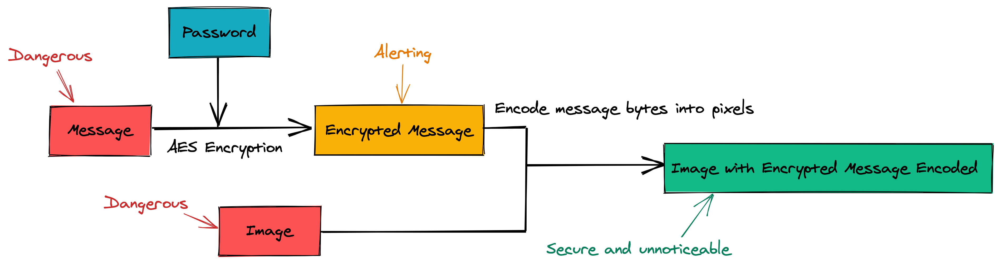
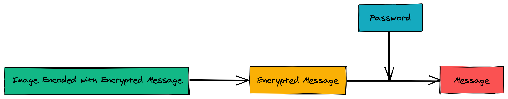
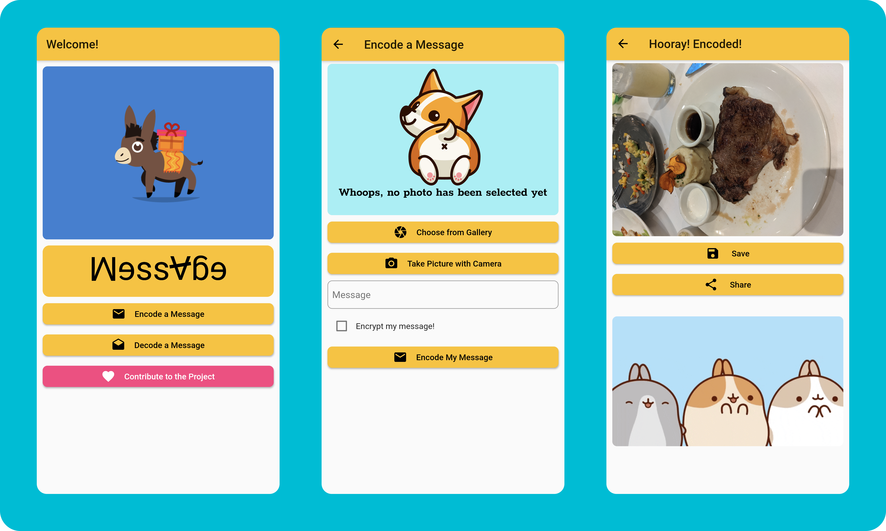
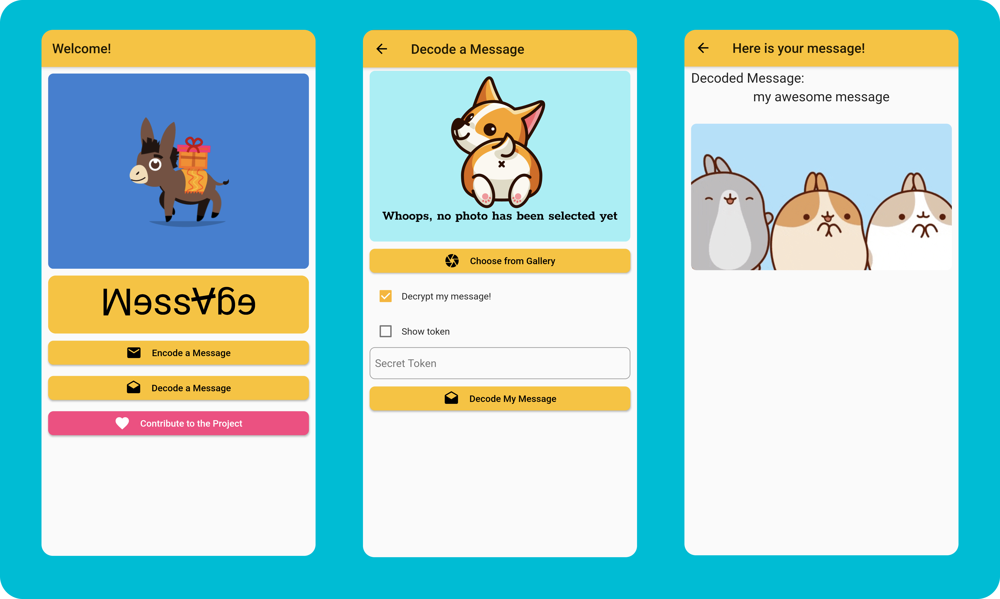

# Mini Donkey

**Mini Donkey** carries private messages **securely** and **secretly** with encryption ([AES](https://en.wikipedia.org/wiki/Advanced_Encryption_Standard)) and [steganography](https://en.wikipedia.org/wiki/Steganography) (technique of concealing messages in images).

## Repository Status

| Task ID | Description | Status @ [master](https://github.com/tianhaoz95/photochat) | Link |
|:----:|:-----------:|:------:|:----:|
| Heimdall | Static analysis, lint and unit tests |  | [check heimdall status](https://github.com/tianhaoz95/photochat/actions?query=workflow%3Aheimdall+branch%3Amaster) |
| Thor | End to end tests |  |  [check thor status](https://github.com/tianhaoz95/photochat/actions?query=workflow%3Athor+branch%3Amaster) |
| Loki | App release |  |  [check loki status](https://github.com/tianhaoz95/photochat/actions?query=workflow%3Aloki+branch%3Amaster) |
|Gitpod | Prebuilt workspace |  | [open workspace](https://gitpod.io/#https://github.com/tianhaoz95/photochat) |

## Getting started

| Platform | Download | Alternative Source |
|:--------:|:--------:|:------------------:|
| Android |  | Coming soon ... |
| iOS | Coming soon... (too poor to buy the $99/year Apple developer account) | Coming soon ... |
| Web | Not planned (pending on Flutter support) | Not planned (pending on Flutter support) |
| MacOS | Not planned (pending on Flutter support) | Not planned (pending on Flutter support) |
| Windows | Not planned (pending on Flutter support) | Not planned (pending on Flutter support) |
| Linux | Not planned (pending on Flutter support) | Not planned (pending on Flutter support) |

## Design

### Encoding Flow: Message -> Encryption -> Encoding (Steganography) -> Image

### Decoding Flow: Image -> Message Extraction -> Decryption -> Message

## Demo

### Encoding Flow: Message -> Encryption -> Encoding (Steganography) -> Image

### Decoding Flow: Image -> Message Extraction -> Decryption -> Message

## Contribute

To ensure the transparency of the implementation (so that no privacy message get stolen secretly), Mini Donkey is completely open source. All kinds of contribution including but not limited to pull requests, feature requests, bug reports, sponsorship, etc, are welcome.
